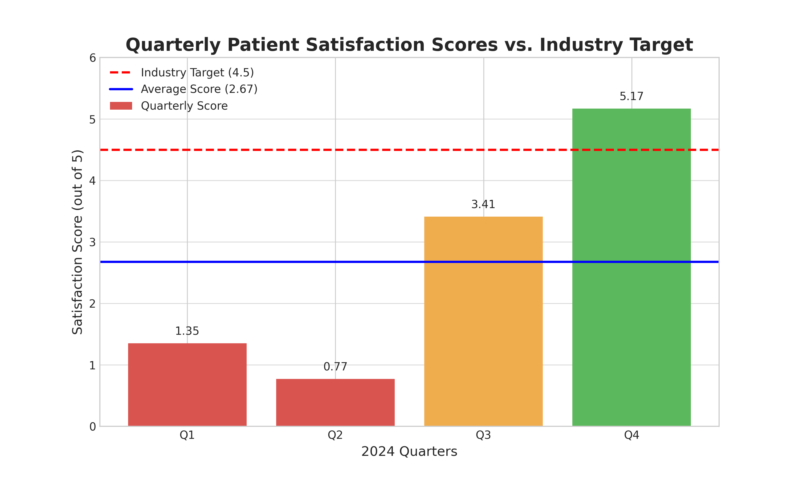

# Advanced Data Visualization: Treemap

**Email:** 23f3003060@ds.study.iitm.ac.in

## 1. Business Challenge

Our organization is currently facing a critical challenge with patient satisfaction. The average patient satisfaction score for 2024 is **2.68**, which is significantly below the industry benchmark of **4.5**. This trend not only affects our reputation but also has substantial financial and operational implications. Urgent, data-driven action is required to identify the root causes and implement effective solutions to elevate the patient experience.

## 2. Data Analysis & Key Findings

To understand the performance trend, the quarterly patient satisfaction scores for 2024 were analyzed.

**Dataset:**
- **Q1:** 1.35
- **Q2:** 0.77
- **Q3:** 3.41
- **Q4:** 5.17

The analysis reveals a volatile but upward trend in patient satisfaction throughout the year. While the scores in the first half of the year were alarmingly low, there was a significant recovery in the second half.

### Key Findings:

1.  **Low Overall Performance:** The annual average score of **2.68** is a clear indicator that we are failing to meet patient expectations consistently.
2.  **Extreme Volatility:** The sharp contrast between Q2 (0.77) and Q4 (5.17) suggests that operational inconsistencies may be a primary driver of patient dissatisfaction.
3.  **Positive Momentum:** The strong performance in Q4 indicates that recent improvements or initiatives may be having a positive effect. This provides a foundation to build upon.

## 3. Business Implications

The current trend of low patient satisfaction has several serious business implications:

- **Reputational Damage:** Consistently low scores can harm our brand and reduce patient trust, leading to a decline in patient volume over time.
- **Financial Impact:** Patient satisfaction is increasingly tied to reimbursement rates and value-based care payments. Poor performance can lead to direct revenue loss.
- **Staff Morale:** A stressful environment marked by patient complaints can lead to employee burnout and high turnover rates.

## 4. Recommendations to Reach the 4.5 Target

To address these challenges and achieve our target score of 4.5, a focused effort on operational excellence is required. The primary recommendation is to **improve service quality and reduce wait times.**

### Specific Actionable Steps:

1.  **Optimize Patient Flow:**
    - **Action:** Implement a real-time patient tracking system to identify bottlenecks in the patient journey from check-in to discharge.
    - **Goal:** Reduce average wait times by 25% within the next two quarters.

2.  **Enhance Staff Training in Patient Communication:**
    - **Action:** Develop and roll out a mandatory monthly training module for all patient-facing staff, focusing on empathy, clear communication, and service recovery.
    - **Goal:** Improve patient-provider communication scores on post-visit surveys by 40%.

3.  **Streamline Administrative Processes:**
    - **Action:** Digitize all patient intake and billing processes to reduce paperwork and minimize administrative errors.
    - **Goal:** Decrease the average time for patient check-in and check-out by 50%.

By implementing these targeted strategies, we can build on the positive momentum from Q4 and create a consistently exceptional patient experience, ultimately achieving and surpassing the industry benchmark.

Finalised!!
