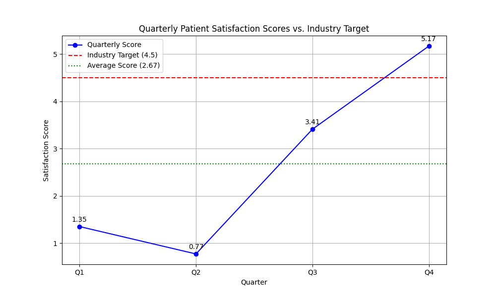

# Healthcare Performance Analysis

This report provides a comprehensive analysis of the quarterly patient satisfaction scores for 2024. The analysis highlights a significant gap between our performance and the industry benchmark, and provides actionable recommendations to address this issue.

**Contact Email:** 23f3003060@ds.study.iitm.ac.in

## Key Findings

The patient satisfaction data for 2024 is as follows:
- **Q1:** 1.35
- **Q2:** 0.77
- **Q3:** 3.41
- **Q4:** 5.17

The average patient satisfaction score for the year is **2.68**, which is significantly below the industry target of **4.5**. While there was a strong recovery in the latter half of the year, the overall performance is a cause for concern.

## Data Visualization

The following chart illustrates the trend of our quarterly satisfaction scores compared to the industry benchmark.

## Business Implications

The current trend has several serious business implications:
- **Patient Churn:** Dissatisfied patients are likely to seek services from competitors, leading to a loss of market share.
- **Damaged Reputation:** Poor satisfaction scores can harm our brand's reputation, making it difficult to attract new patients.
- **Financial Impact:** A decline in patient volume and a damaged reputation can lead to decreased revenue and profitability.

## Recommendations

To achieve the target satisfaction score of 4.5, we must focus on improving two key areas: **service quality and wait times.**

Here are specific recommendations:
1.  **Enhance Service Quality:**
    *   Invest in staff training programs focused on patient communication and empathy.
    *   Implement a system for gathering real-time patient feedback to quickly address issues.
    *   Recognize and reward staff members who consistently receive positive patient feedback.
2.  **Reduce Patient Wait Times:**
    *   Optimize appointment scheduling systems to better predict and manage patient flow.
    *   Hire additional clinical and administrative staff to reduce bottlenecks.
    *   Implement a patient portal that allows for pre-registration and online check-in to streamline the on-site process.

---
*This analysis was generated with assistance from an LLM. For more information, visit [ChatGPT Codex Tasks](https://chatgpt.com/codex/tasks).*
